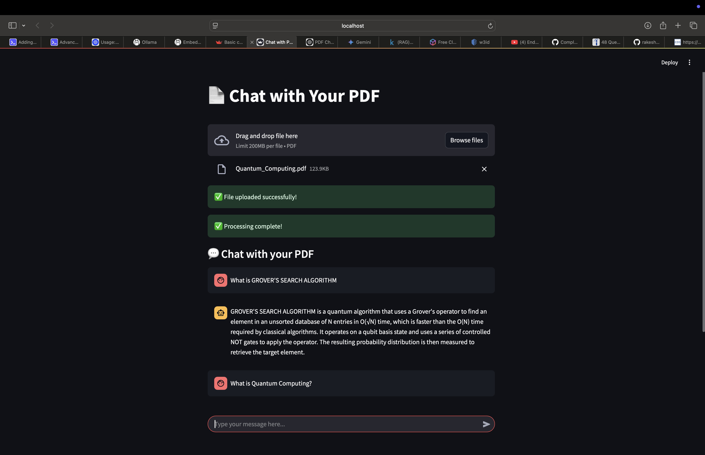
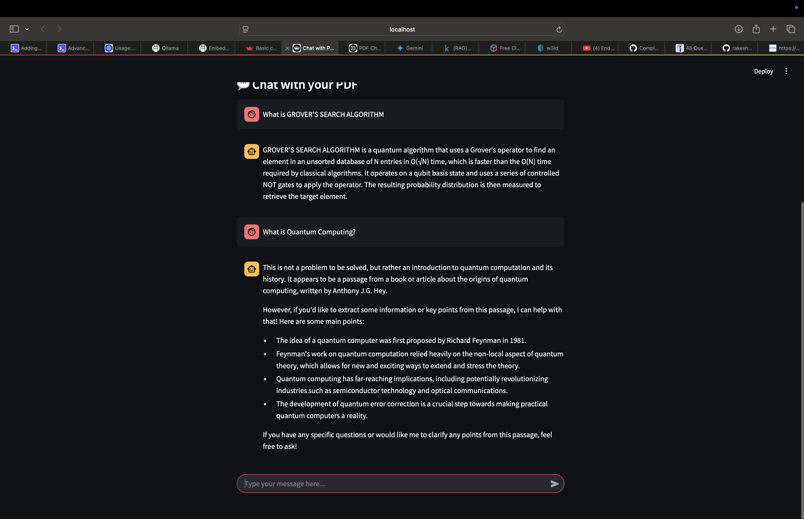
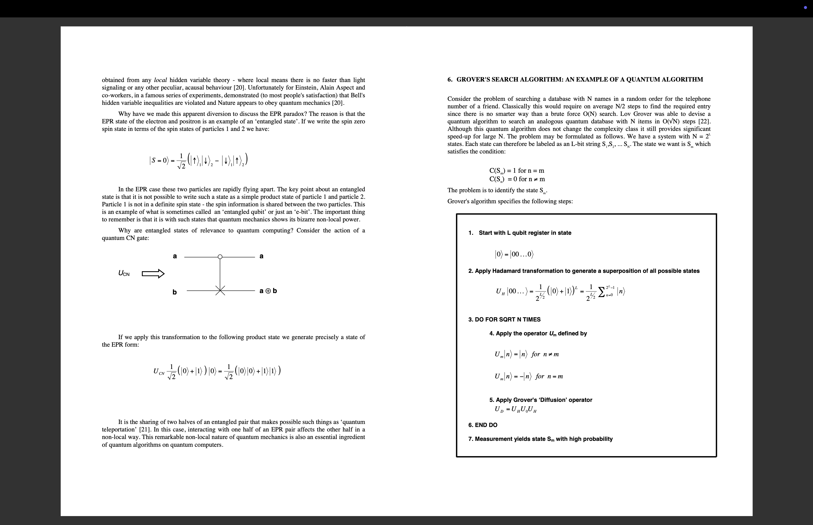

# 📄 PDF-Genie

## Overview
This project is a **PDF Reader with an LLM-powered chatbot** that allows users to upload a PDF and interact with its content using natural language queries. It leverages **Ollama** to run open-source LLMs locally, and utilizes **LangChain**, **Streamlit**, and **ChromaDB** for embedding storage and retrieval-augmented generation (RAG).

## Features
- 📂 **Upload PDFs** and extract text efficiently.
- 🔍 **Retrieve relevant document sections** using embeddings and vector search.
- 🤖 **Chat with your PDF** using an LLM-powered chatbot.
- ⚡ **Runs locally** without requiring cloud-based LLMs.

## Tech Stack
- **Frontend**: Streamlit (for UI)
- **LLM**: Ollama (running Llama models locally)
- **Retrieval & Embeddings**: LangChain, ChromaDB
- **PDF Processing**: PyMuPDF (fitz)

---

## Installation & Setup

### 1️⃣ Clone the repository
```bash
git clone https://github.com/AmiteshVerma24/PDF-Genie.git
cd PDF-Genie
```

### 2️⃣ Install dependencies
```bash
pip install -r requirements.txt
```

### 3️⃣ Run Ollama (to use LLM locally)
Ensure you have Ollama installed and running. If not, install it from [ollama.ai](https://ollama.ai) and start the required model:
```bash
ollama pull llama3.2
```

### 4️⃣ Run the Streamlit app
```bash
streamlit run main.py
```

---
## Images




---

## Project Structure
```
├── main.py             # Streamlit UI for chatbot
├── backend/
│   ├── pdf_processor.py   # Extracts text from PDFs
│   ├── embedding.py       # Generates and stores embeddings
│   ├── rag_pipeline.py    # Implements the RAG-based chatbot
│   ├── __init__.py        # Exposes backend functions
├── requirements.txt   # Dependencies
```

---

## How It Works
1. **Upload a PDF**: The app extracts text from the uploaded file.
2. **Generate Embeddings**: The text is split into chunks, converted into embeddings using Ollama, and stored in ChromaDB.
3. **Chat with the PDF**: User queries are matched with the most relevant document chunks, and the LLM generates a response using the retrieved context.

---

## License
This project is open-source and available under the MIT License.

🚀 Happy Coding!

